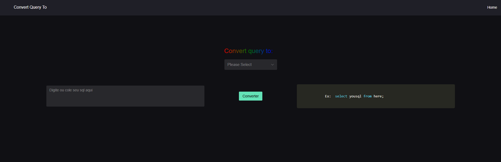

# Convert Query To

## Sobre o Projeto

**Convert Query To** é uma aplicação desenvolvida para facilitar a conversão de queries SQL entre diferentes bancos de dados. Com uma interface intuitiva e um design moderno, a ferramenta permite que os usuários insiram sua query SQL e escolham para qual sistema desejam convertê-la.

## Funcionalidades
- Inserção de queries SQL
- Seleção do banco de dados de destino
- Conversão automática da query
- Interface escura e moderna para melhor experiência do usuário

## Demonstração
Abaixo está uma captura de tela da aplicação em funcionamento:



## Como Executar
1. Clone este repositório:
   ```sh
   git clone https://github.com/seu-usuario/seu-repositorio.git
   ```
2. Acesse o diretório do projeto:
   ```sh
   cd seu-repositorio
   ```
3. Instale as dependências:
   ```sh
   npm install
   ```
4. Inicie a aplicação:
   ```sh
   npm start
   ```

## Tecnologias Utilizadas
- Node.js
- React/Nuxt.js (dependendo do seu frontend)
- Tailwind CSS (ou outra biblioteca de estilos que esteja utilizando)

## Contribuição
Contribuições são bem-vindas! Sinta-se à vontade para abrir um issue ou enviar um pull request.

## Licença
Este projeto está sob a licença MIT. Veja o arquivo `LICENSE` para mais detalhes.

